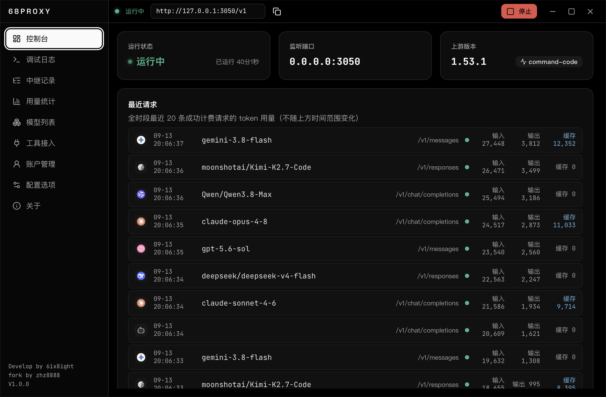
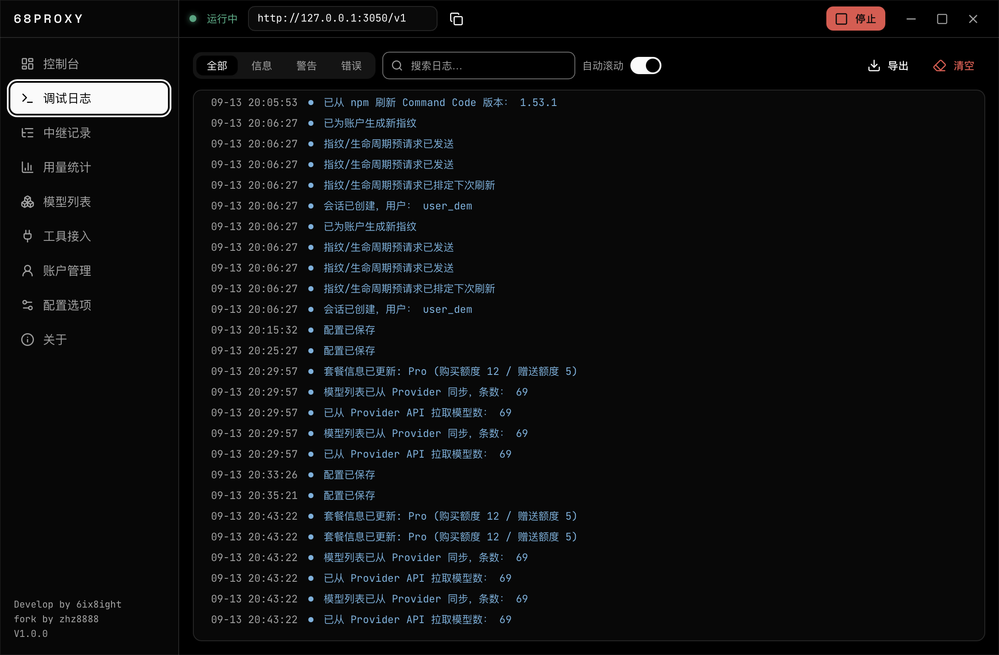
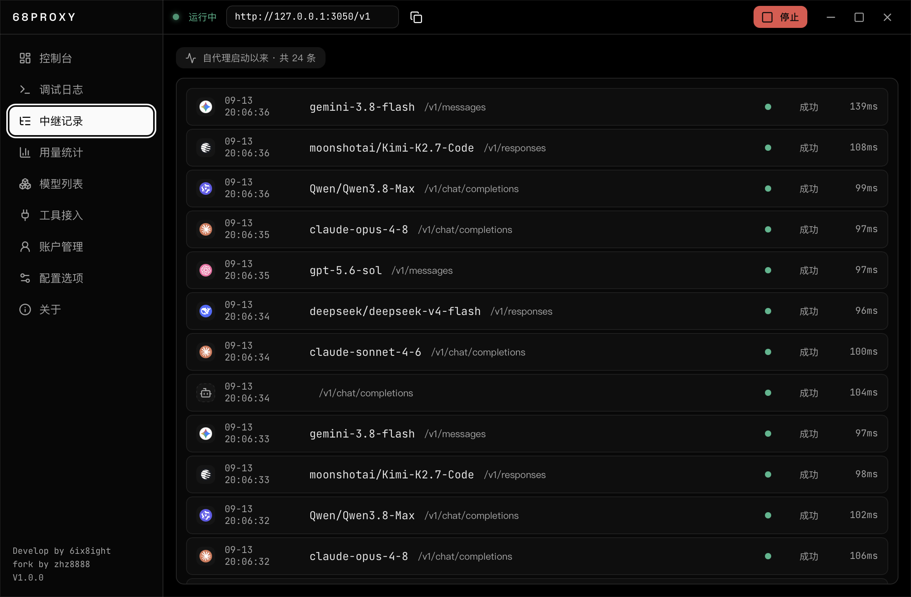
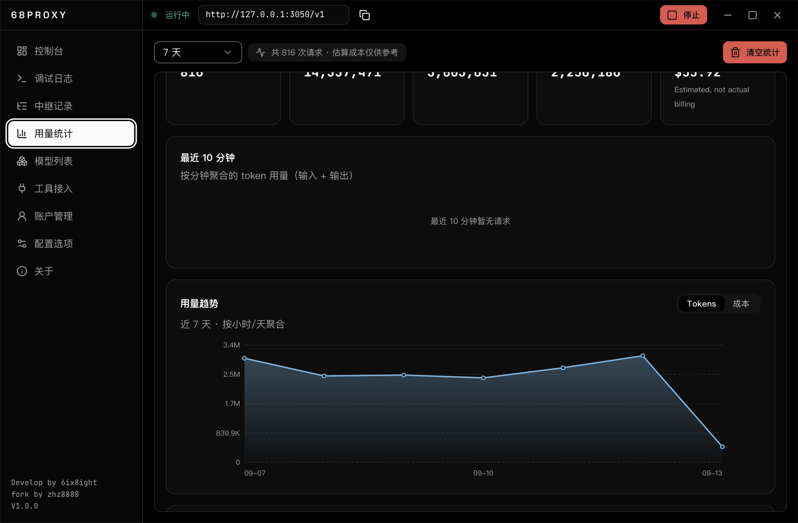
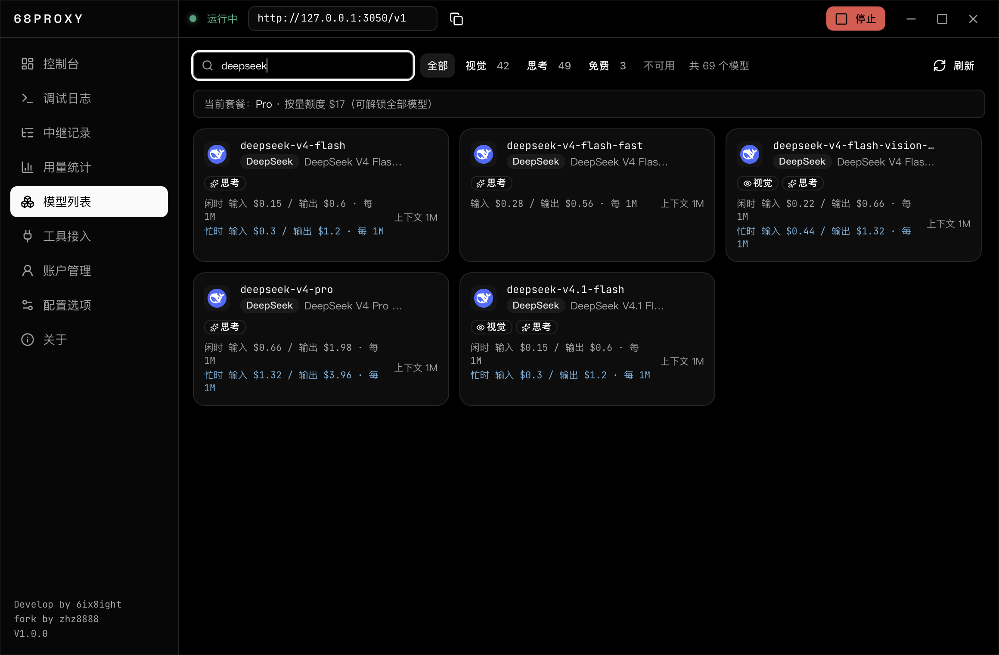
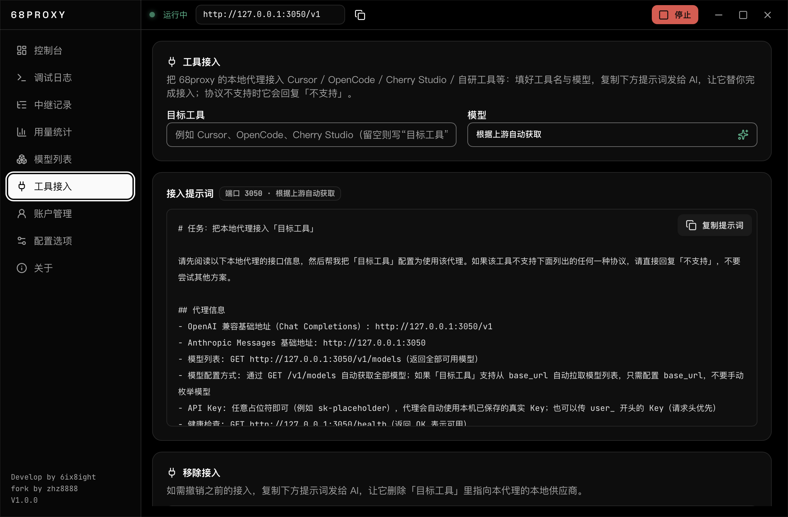
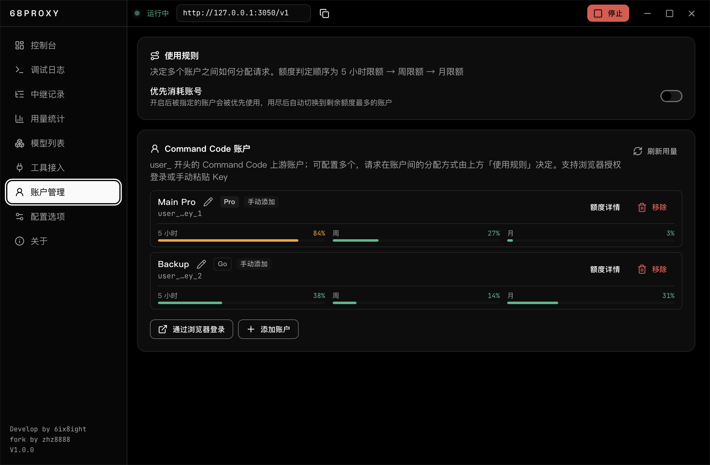
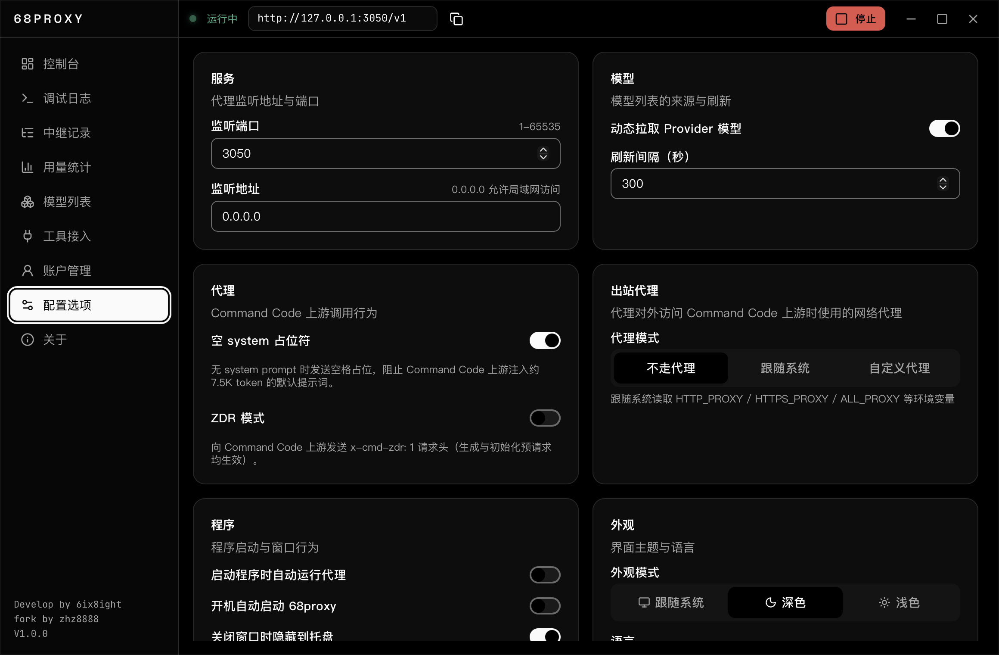
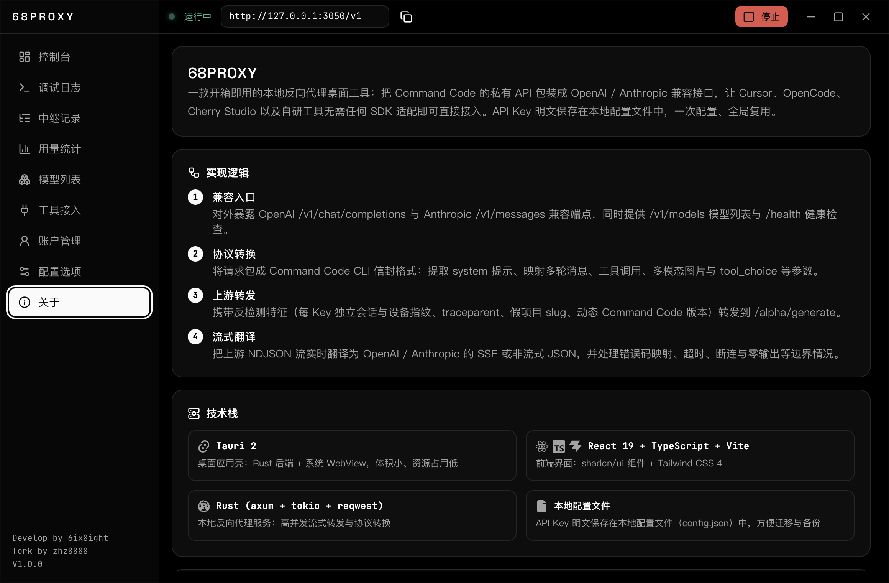

<p align="center">
  
</p>

<p align="center">
  <a href="./README_en.md">🌐 English</a>
</p>

<p align="center">
  
  
  
  
</p>

> 本仓库为 [evanfu0110/68proxy](https://github.com/evanfu0110/68proxy) 的个人 fork，在原版基础上持续维护与增强。

**68PROXY** 是一款开箱即用的本地**反向代理 + 协议转换网关**：作为客户端与 Command Code 之间的一层中转，它把请求改写成 CC CLI 信封格式并代理至上游，同时对外暴露 OpenAI Chat Completions / Responses 与 Anthropic Messages 兼容接口——让 Cursor、OpenCode、Cherry Studio、Codex CLI 以及自研工具无需任何 SDK 适配即可直接接入。支持多 CC 账户按轮询负载均衡，本地转发 Key（`sk-`）与 CC 账户 Key（`user_`）分离管理；界面内置中英文双语与明暗主题，一次配置、全局复用。

---

<p align="center">
  
</p>

| 页面 | 截图 |
|------|------|
| 📊 **控制台** |  |
| 🐞 **调试日志** |  |
| 🛰️ **中继记录** |  |
| 📈 **用量统计** |  |
| 📦 **模型列表** |  |
| 🔌 **工具接入** |  |
| 👤 **账户管理** |  |
| ⚙️ **配置选项** |  |
| ℹ️ **关于** |  |

<p align="center">
  
</p>

| 模块 | 说明 |
|------|------|
| 📊 **控制台** | 运行状态、监听端口、上游版本一目了然；最近请求卡片实时呈现中继动态，代理地址一键复制；一键启动 / 停止 / 重启与健康检查 |
| 🛰️ **中继记录** | 自代理启动以来每次请求实时呈现：时间、模型、路径、状态与耗时；点击可查看完整详情（请求 ID、流式模式、Token 用量与最后事件） |
| 📈 **用量统计** | SQLite 持久化的 token 用量统计：汇总卡片（请求数 / 输入 / 缓存 / 输出 / 估算成本）、按小时/天聚合的趋势面积图、最近 10 分钟迷你柱状图、按模型 / 端点分组明细与最近请求列表；支持今日 / 24h / 7D / 30D / 60D / 全部时间范围，可一键清空 |
| 📦 **模型列表** | 从 Provider 端点动态拉取模型（离线回退内置 69 个模型基线），厂商、上下文长度、能力（视觉 / 思考）与价格（闲 / 忙时、分档计费）一屏尽览；价格与优惠数据由 `tools/fetch-pricing.mjs` 从官方文档爬取生成并随版本打包；支持搜索、能力筛选与一键复制模型 ID |
| 🔌 **工具接入** | 输入目标工具名与模型，自动生成接入提示词，让 AI 替你完成 Cursor / OpenCode / Cherry Studio 等工具的配置；协议不支持时自动回复「不支持」，附移除接入的提示词 |
| 🐞 **调试日志** | 内存环形日志 + 实时推送，支持级别过滤、关键词搜索、自动滚动与一键清空，可导出最近 1000 条 |
| ⚙️ **配置** | 端口 / 监听地址（含端口占用检测与一键释放）、模型来源与刷新间隔、启动行为（自动运行 / 开机自启 / 托盘）、**外观（界面主题跟随系统 / 深色 / 浅色，界面语言简体中文 / English）**、**出站代理（不走代理 / 跟随系统环境变量 / 自定义 SOCKS5 或 HTTP）**、日志级别、token 用量统计开关与保留天数、本地转发 Key（`sk-`，可一键随机生成），改动自动保存；另有「空 system 占位符」与「ZDR 模式」两个 CC 上游调用行为开关 |
| 👤 **账户** | 管理 Command Code 上游账户（`user_`，支持多个）：浏览器授权登录或手动粘贴 Key 添加，可自定义显示名、移除，账户行内即览 5 小时 / 周 / 月用量，点开「额度详情」查看套餐、月 / 购买 / 赠送余额与周期信息。可配置**使用规则**：轮询负载均衡，或指定一个优先消耗的账户（用尽后自动切换到剩余额度最多的账户），并保证同一会话固定使用同一账户以免上游缓存失效 |
| 🎛️ **系统托盘** | 最小化到托盘运行，托盘菜单可显示窗口、启动 / 停止 / 重启代理与退出 |

<p align="center">
  
</p>

1. **兼容入口** — 对外暴露 OpenAI `/v1/chat/completions`、OpenAI Responses `/v1/responses` 与 Anthropic `/v1/messages` 兼容端点，同时提供 `/v1/models` 模型列表与 `/health` 健康检查
2. **协议转换** — 将请求包装成 Command Code CLI 信封格式：提取 system 提示、映射多轮消息、工具调用、多模态图片与 tool_choice 等参数；Responses 请求的 instructions、input 条目、function_call / function_call_output 回灌一并转换
3. **上游转发** — 携带反检测特征（每 Key 独立会话与设备指纹、traceparent、假项目 slug、动态 CC 版本）转发至 `/alpha/generate`
4. **流式翻译** — 把上游 NDJSON 流实时翻译为 OpenAI / Responses / Anthropic 的 SSE 事件或非流式 JSON，并处理错误码映射、超时、断连与零输出等边界情况
5. **用量统计** — 请求完成后在流式结束 / 非流式成功两条路径记录 token 用量到 SQLite（零输出或失败请求不计入），按官方价格表估算成本，并按天预聚合支撑大时间窗快速查询

<p align="center">
  
</p>

**环境要求：** Node.js ≥ 20.19（或 ≥ 22.12）、pnpm、Rust 工具链（构建 Tauri 后端，含系统依赖）。

```bash
# 安装依赖
pnpm install

# 前端开发模式（Vite，仅界面，需另开后端才能调通 IPC）
pnpm dev

# 桌面开发模式（Tauri，前端 + Rust 后端，推荐）
pnpm tauri dev

# 构建桌面安装包
pnpm tauri build
```

> **浏览器调试前端**：开发模式下除 `pnpm tauri dev` 打开桌面窗口外，也可用浏览器直接访问 Vite 服务（默认 <http://localhost:1420>），界面同样能调用 Rust 后端——只需同时运行 `pnpm tauri dev`（或 `cargo run`），前端会自动检测并经由本机调试桥接（`127.0.0.1:1431`）转发命令与事件，便于使用浏览器 DevTools 调试。该桥接仅在 debug 构建存在，release 构建完全不包含，端口可用 `CC_DEV_BRIDGE_PORT` 覆写。

**快速接入**：启动代理前，先在「配置」随机生成一个本地转发 Key（`sk-` 开头），并在「账户」页添加至少一个 CC 账户 Key（`user_` 开头）。然后启动代理，在任意 OpenAI / Anthropic 兼容客户端中配置：

```
OpenAI 兼容 Base URL   http://127.0.0.1:3050/v1   （含 /v1/responses，
                                                   Codex CLI 等 Responses 客户端同样适用）
Anthropic Base URL     http://127.0.0.1:3050
模型                   deepseek/deepseek-v4-flash 等（见「模型列表」）
API Key                本地转发 Key（sk- 开头，见「配置」），
                       配置多个客户端可共用同一个
```

> 本地转发 Key（`sk-`）只用于本地代理鉴权，不会发送给 CC 上游；CC 账户 Key（`user_`）在「账户」页管理，可配置多个，请求在账户间的分配方式由「使用规则」决定（默认按轮询）。两类 Key 与全部设置均保存在本机 SQLite（`usage.sqlite` 的 `settings` 表，`config.json` 仅作镜像兜底），仅本机可见；请勿将这些文件分享给他人。

<p align="center">
  
</p>

| 前端 | 后端 | 工具 |
|------|------|------|
| Tauri 2 | Rust（axum + tokio + reqwest + rusqlite） | tauri-cli |
| React 19 + TypeScript | SQLite（设置 / 用量 / 模型数据），config.json 兜底 | Windows / macOS |
| Vite + Tailwind CSS 4 | serde / chrono / uuid / rand / sha2 | shadcn/ui |
| Radix + lucide-react + react-icons + sonner + i18next | tower-http + CORS | |

<p align="center">
  
</p>

```
68proxy/
├── src/                      # React 前端
│   ├── components/           # UI 组件（StatusLamp / RecentRequestsCard / ModelLogo / QuotaDetail / UsageTrendChart / UsageMiniBars / UrlRow …）
│   ├── views/                # 页面（控制台 / 调试日志 / 中继记录 / 用量统计 / 模型列表 / 工具接入 / 账户 / 配置 / 关于）
│   ├── i18n/                 # 中英文本地化（i18next + locales 词条）
│   └── lib/                  # 共享模块（api.ts / ipc.ts / format.ts / status.ts / messages.ts / language.ts / theme.ts / platform.ts / constants.ts）
├── src-tauri/
│   ├── src/
│   │   ├── lib.rs            # Tauri 命令、系统托盘、生命周期
│   │   ├── credentials.rs    # 凭据管理（本地 sk- Key + CC 账户轮询）
│   │   ├── dev_bridge.rs     # 浏览器直连调试桥接（仅 debug 构建）
│   │   ├── i18n.rs           # 后端日志 / 错误消息本地化
│   │   └── proxy/            # Rust 反向代理核心
│   │       ├── server.rs     # axum 路由，流式 / 非流式转发
│   │       ├── convert.rs    # OpenAI / Responses / Anthropic ↔ CC 协议转换
│   │       ├── cc_client.rs  # CC 上游客户端、会话 / 指纹、模型拉取
│   │       ├── sse.rs        # NDJSON → SSE 翻译器
│   │       ├── usage.rs      # token 用量统计（SQLite 三表 + 按天预聚合）
│   │       ├── models.rs     # 模型列表 / 价格持久化（models 与 model_pricing 双表）
│   │       ├── pricing.rs    # 价格表与成本估算
│   │       ├── plans.rs      # 套餐准入规则
│   │       ├── quota.rs      # 账户额度拉取
│   │       ├── settings.rs   # 设置持久化（SQLite settings 表）
│   │       ├── auth_login.rs # 浏览器授权登录
│   │       ├── fingerprint.rs# 反检测设备指纹
│   │       ├── config.rs     # 配置加载 / 校验 / 环境变量覆写
│   │       ├── errors.rs     # 上游错误码 → 下游协议错误映射
│   │       ├── log.rs        # 内存环形日志
│   │       ├── state.rs      # 共享状态（会话 / 缓存 / 请求队列）
│   │       └── ...
│   ├── icons/                # 应用图标
│   └── tauri.conf.json       # Tauri 配置
├── assets/readme/            # README 装饰资源（SVG）
├── screenshots/            # 界面预览截图（en/ 为英文界面）
├── tools/fetch-pricing.mjs   # 价格数据爬取脚本（生成打包用 pricing.json）
├── tools/clean_cache.py      # 构建缓存清理脚本（遍历后经确认再删除）
└── tools/icon-render/        # 图标渲染工具
```

<p align="center">
  
</p>

```bash
# Windows（NSIS 安装包）
pnpm tauri build --bundles nsis

# macOS（Apple Silicon arm64 dmg）
pnpm tauri build --bundles dmg --target aarch64-apple-darwin
```

输出产物：

| 平台 | 版本 | 文件 | 说明 |
|------|------|------|------|
| 🖥️ Windows | **安装版** | `target/release/bundle/nsis/68proxy_<version>_x64-setup.exe` | NSIS 安装程序，含桌面快捷方式、开始菜单、卸载入口，适合日常使用 |
| 🖥️ Windows | **便携版** | `68proxy.exe` | 免安装，双击即用，适合移动/绿色使用 |
| 🍎 macOS | **dmg 镜像** | `target/aarch64-apple-darwin/release/bundle/dmg/68proxy_<version>_aarch64.dmg` | Apple Silicon（arm64）dmg；未完成 Apple 公证，首次打开方式见下方说明 |
| 🍎 macOS | **应用包 zip** | `target/aarch64-apple-darwin/release/bundle/macos/68proxy.app` | 打包为 `68proxy-<version>-macOS-aarch64.app.zip`，解压得到 `68proxy.app`，拖入「应用程序」即可；适合脚本分发或不便挂载磁盘映像的场景 |

> GitHub Releases 同时提供 Windows 两种版本与 macOS 的 dmg、应用包 zip；macOS 两个产物内容相同，按习惯二选一。

> **macOS 首次打开说明**：应用未经 Apple 签名与公证，首次打开可能被 Gatekeeper 拦截。可在「访达 → 应用程序」中右键应用 →「打开」绕过，或在终端执行以下命令移除隔离属性：
>
> ```bash
> sudo xattr -r -d com.apple.quarantine /Applications/68proxy.app
> ```

<p align="center">
  
</p>

- [Command Code](https://commandcode.ai) — 上游 API 提供商
- [Tauri](https://tauri.app) — 桌面应用框架
- [axum](https://github.com/tokio-rs/axum) — Rust Web 框架

<p align="center">
  
</p>

本仓库为 [evanfu0110/68proxy](https://github.com/evanfu0110/68proxy) 的个人 fork，基于上游 [MIT](LICENSE) 许可。上游版权归 6ix8ight，fork 维护与增强部分归 zhz8888。

[MIT](LICENSE) © 6ix8ight · fork © zhz8888
