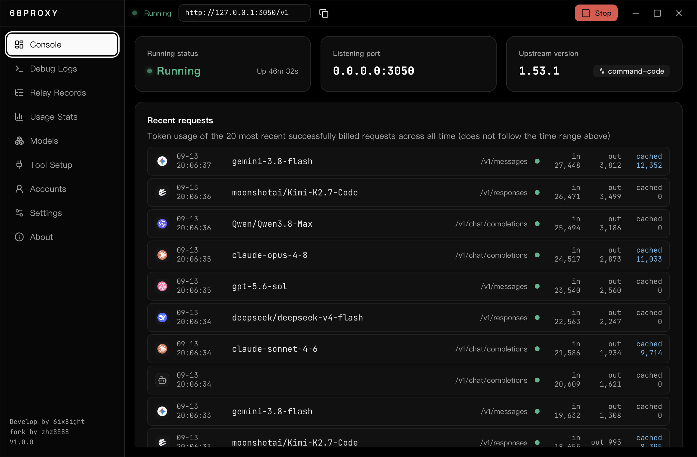
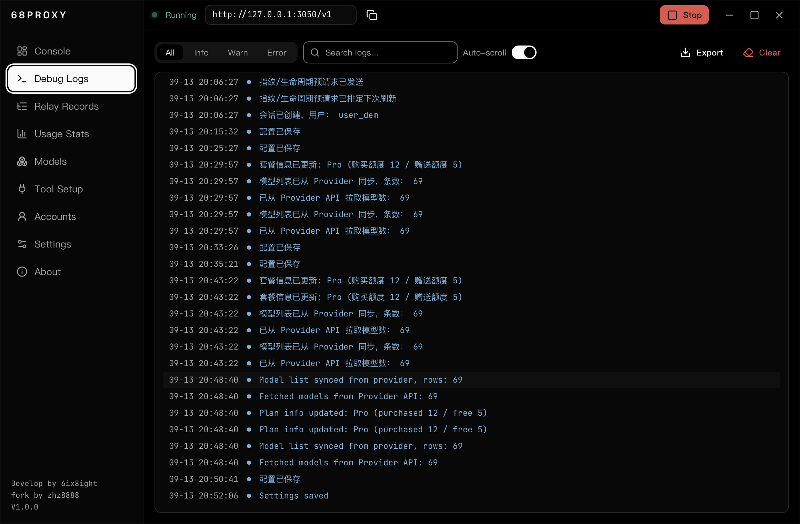
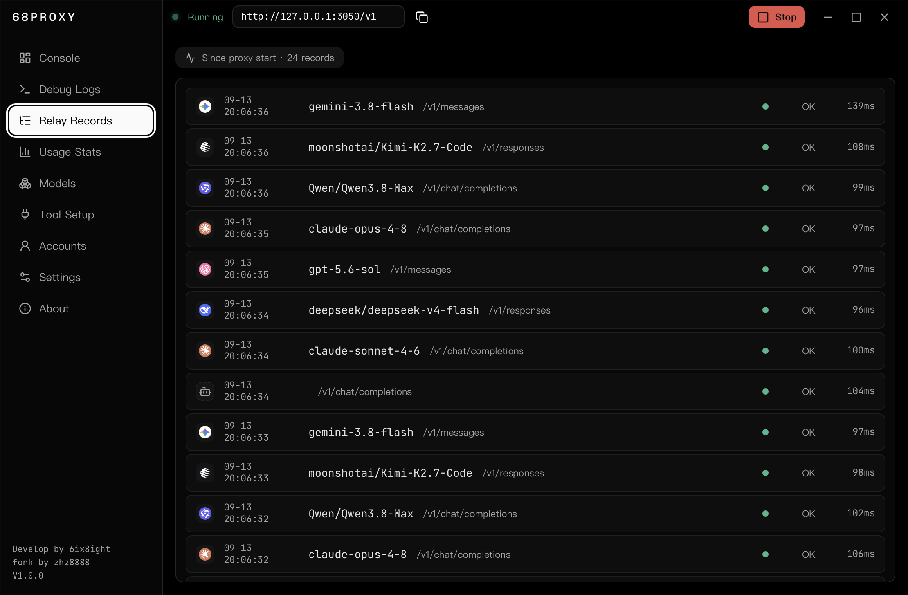
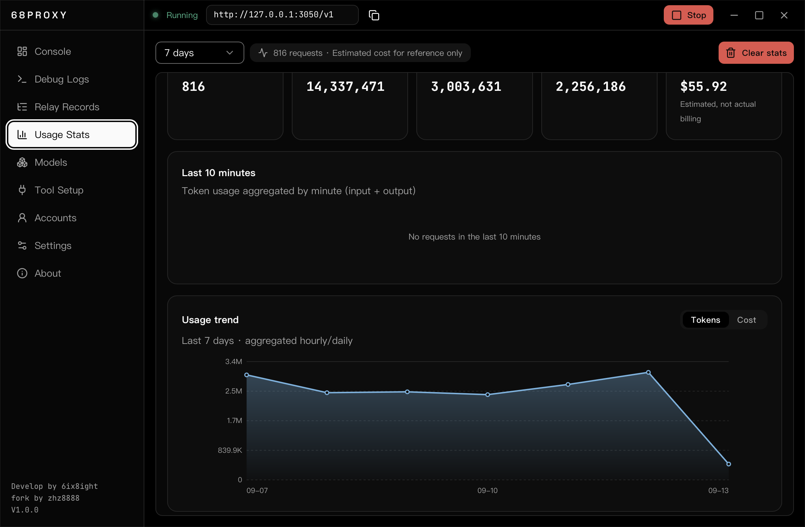
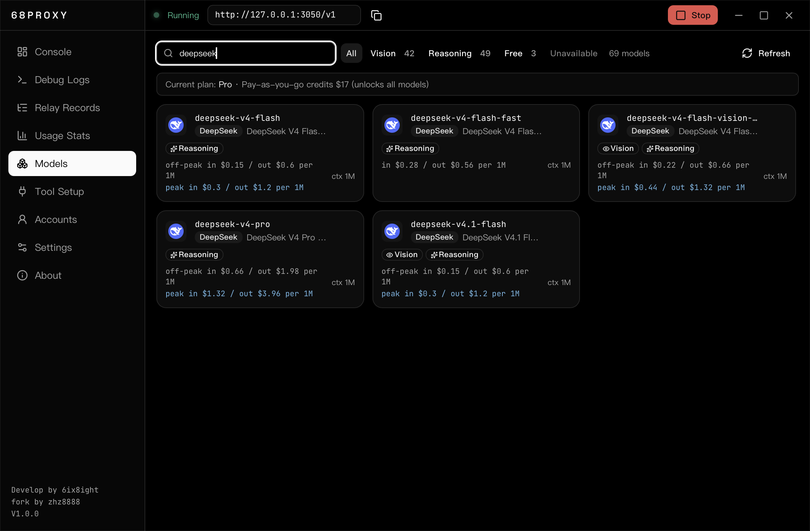
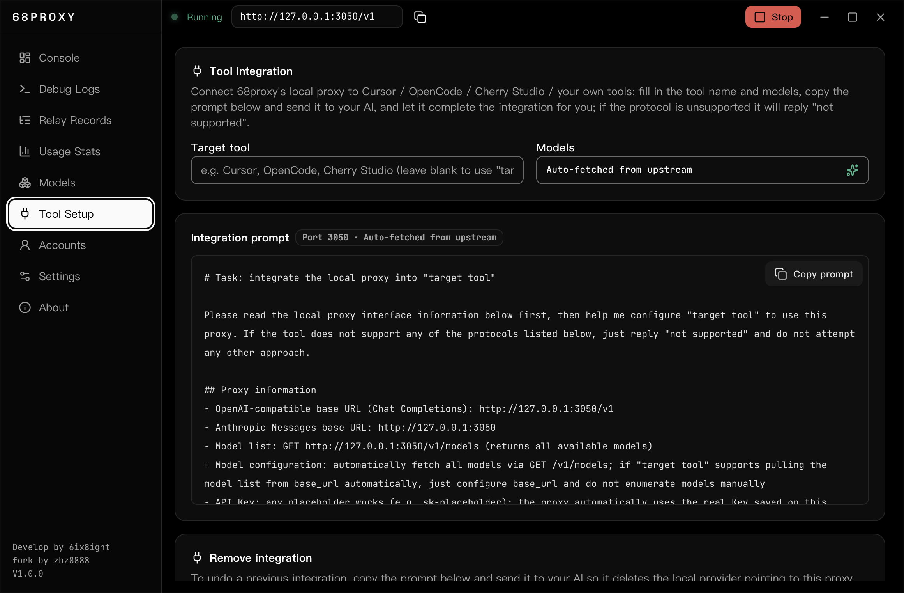
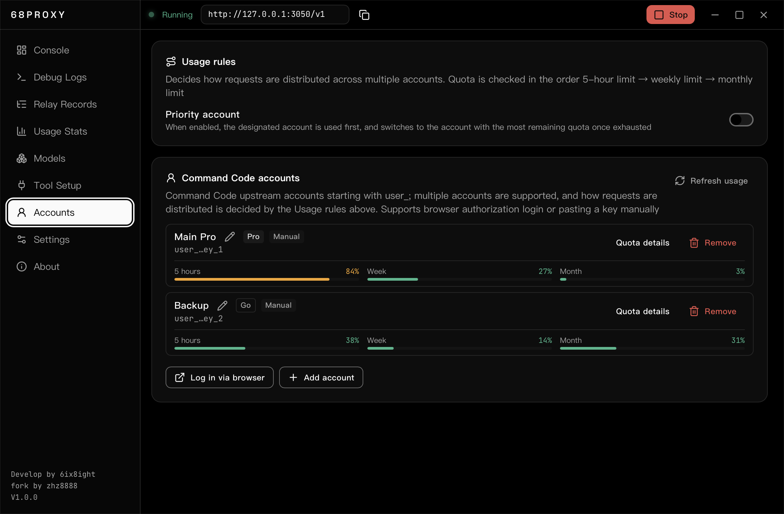
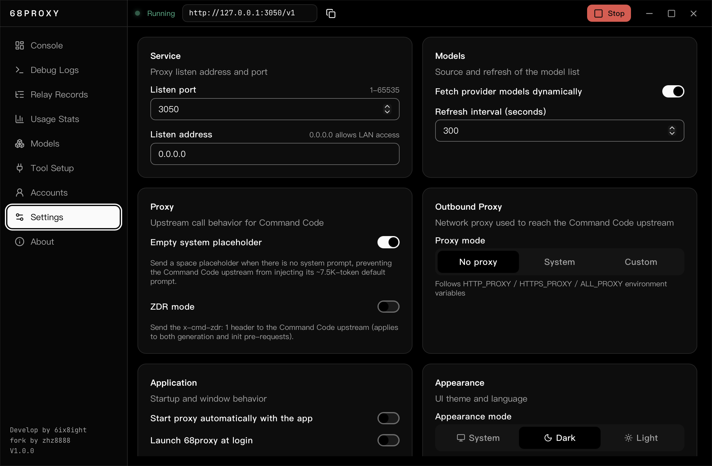
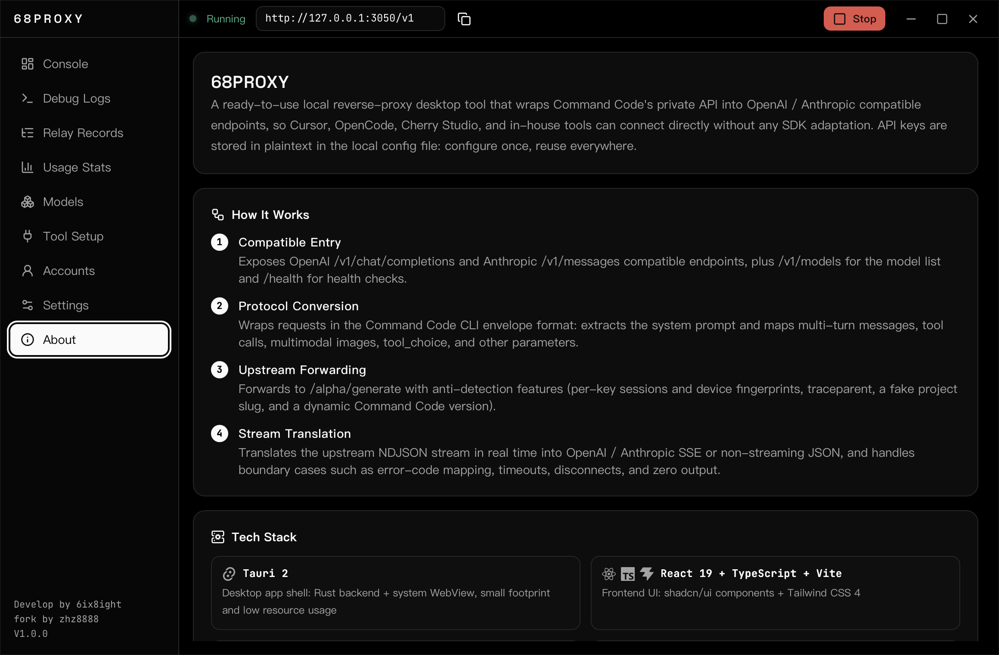

<p align="center">
  
</p>

<p align="center">
  <a href="./README.md">🌐 中文</a>
</p>

<p align="center">
  
  
  
  
</p>

> This repository is a personal fork of [evanfu0110/68proxy](https://github.com/evanfu0110/68proxy), actively maintained and enhanced on top of the original.

**68PROXY** is a plug-and-play local **reverse proxy + protocol gateway**: a relay between your clients and Command Code that rewrites requests into the CC CLI envelope format and forwards them upstream, while exposing OpenAI / Anthropic compatible endpoints — so Cursor, OpenCode, Cherry Studio and your own tools can connect directly without any SDK adaptation. Multiple CC accounts are load-balanced in round-robin, local forwarding keys (`sk-`) and CC account keys (`user_`) are managed separately, and the UI ships with a bilingual (Chinese / English) interface plus light / dark themes — configure once, reuse everywhere.

---

<p align="center">
  
</p>

| Page | Preview |
|------|---------|
| 📊 **Console** |  |
| 🐞 **Debug Logs** |  |
| 🛰️ **Relay Records** |  |
| 📈 **Usage Stats** |  |
| 📦 **Models** |  |
| 🔌 **Tool Integration** |  |
| 👤 **Accounts** |  |
| ⚙️ **Settings** |  |
| ℹ️ **About** |  |

<p align="center">
  
</p>

| Module | Description |
|--------|-------------|
| 📊 **Console** | Running state, listening port and upstream version at a glance; a recent-requests card shows live relay activity and proxy addresses are one click away; start / stop / restart and health check |
| 🛰️ **Relay Records** | Every request since proxy start rendered in real time: time, model, path, status and elapsed time; click for full details (request ID, streaming mode, token usage and last event) |
| 📈 **Usage Stats** | SQLite-persisted token usage stats: summary cards (requests / input / cached / output / estimated cost), an hourly-daily aggregated trend area chart, a last-10-minutes mini bar chart, per-model / per-endpoint breakdown and recent request list; supports Today / 24h / 7D / 30D / 60D / All ranges and one-click clear |
| 📦 **Models** | Models fetched live from the Provider endpoint (falls back to the 69-model built-in baseline offline): provider, context length, capabilities (vision / reasoning) and pricing (off-peak / peak, tiered billing) at a glance; price and deal data is scraped from the official docs by `tools/fetch-pricing.mjs` and shipped with each version; search, capability filters and one-click copy of model IDs |
| 🔌 **Tool Integration** | Enter a target tool name and model to auto-generate an integration prompt — let AI wire up Cursor / OpenCode / Cherry Studio for you; it replies 「not supported」 when the protocol is incompatible, and also offers a removal prompt |
| 🐞 **Debug Logs** | In-memory ring buffer with live push, level filter, keyword search, auto-scroll and one-click clear, plus export of the latest 1,000 entries |
| ⚙️ **Settings** | Port / listen address (with port-in-use detection and one-click release), model source and refresh interval, startup behavior (auto-run, autostart, tray), **appearance (theme: follow system / dark / light; language: Chinese / English)**, **outbound proxy (none / follow system env vars / custom SOCKS5 or HTTP)**, log level, token usage tracking toggle and retention days, local forwarding Key (`sk-` prefixed, one-click random generation) — changes saved automatically; plus two CC upstream behavior toggles: "empty system placeholder" and "ZDR mode" |
| 👤 **Accounts** | Manage Command Code upstream accounts (`user_`, multiple supported): add via browser OAuth or by pasting a Key, rename, remove; 5-hour / weekly / monthly usage shows inline on each row, and **Quota details** reveals the plan, monthly / purchased / free balance and billing period. Configure a **usage rule**: round-robin load balancing, or designate a preferred account to drain first (falling back to the account with the most remaining quota), while keeping each session pinned to one account so upstream cache stays warm |
| 🎛️ **System Tray** | Minimize to tray; tray menu shows the window and start / stop / restart the proxy or quit |

<p align="center">
  
</p>

1. **Compatible entry** — Exposes OpenAI `/v1/chat/completions`, OpenAI Responses `/v1/responses` and Anthropic `/v1/messages` compatible endpoints, plus `/v1/models` and `/health`
2. **Protocol conversion** — Wraps requests into the Command Code CLI envelope format: extracts system prompts, maps multi-turn messages, tool calls, multimodal images and tool_choice; Responses `instructions`, `input` items and `function_call` / `function_call_output` round-tripping are converted as well
3. **Upstream forwarding** — Forwards to `/alpha/generate` with anti-detection signals (per-key sessions & device fingerprints, traceparent, fake project slug, dynamic CC version)
4. **Streaming translation** — Translates the upstream NDJSON stream into OpenAI / Responses / Anthropic SSE or non-stream JSON, handling error-code mapping, timeouts, disconnects and zero-output edge cases
5. **Usage tracking** — On completion, token usage is recorded to SQLite on both the streaming-finished and non-streaming success paths (zero-output or failed requests are skipped), cost is estimated from the official price table, and per-day pre-aggregation powers fast queries over large time windows

<p align="center">
  
</p>

**Requirements:** Node.js ≥ 20.19 (or ≥ 22.12), pnpm, and a Rust toolchain (for the Tauri backend, incl. system dependencies).

```bash
# Install dependencies
pnpm install

# Frontend dev mode (Vite — UI only; run the backend separately for IPC)
pnpm dev

# Desktop dev mode (Tauri — frontend + Rust backend, recommended)
pnpm tauri dev

# Build desktop installers
pnpm tauri build
```

> **Debugging the frontend in a browser**: in dev mode you can also open the Vite server directly (default <http://localhost:1420>) instead of the Tauri window — the UI still reaches the Rust backend. Just keep `pnpm tauri dev` (or `cargo run`) running: the frontend detects it is not inside Tauri and routes commands and events through a local debug bridge (`127.0.0.1:1431`), which makes DevTools-based debugging convenient. The bridge only exists in debug builds — release builds exclude it entirely; override the port with `CC_DEV_BRIDGE_PORT`.

**Quick connect:** before starting the proxy, generate a local forwarding Key (`sk-` prefixed) under **Settings**, and add at least one CC account Key (`user_` prefixed) on the **Accounts** page. Then start the proxy and configure any OpenAI / Anthropic compatible client:

```
OpenAI-compatible Base URL   http://127.0.0.1:3050/v1
Anthropic Base URL           http://127.0.0.1:3050
Model                        deepseek/deepseek-v4-flash etc. (see Models)
API Key                      the local forwarding Key (sk- prefixed, see
                             Settings); multiple clients can share it
```

> The local forwarding Key (`sk-`) is only used for local proxy auth and is never sent to the CC upstream. CC account Keys (`user_`) are managed on the Accounts page; you can add several, and how requests are spread across them is decided by the usage rule (round-robin by default). Both keys and all settings live in the local SQLite database (the `settings` table in `usage.sqlite`, with `config.json` as a mirror fallback) — visible only on this machine; don't share these files with others.

<p align="center">
  
</p>

| Frontend | Backend | Tools |
|----------|---------|-------|
| Tauri 2 | Rust (axum + tokio + reqwest + rusqlite) | tauri-cli |
| React 19 + TypeScript | SQLite (settings / usage / model data), config.json as fallback | Windows / macOS |
| Vite + Tailwind CSS 4 | serde / chrono / uuid / rand / sha2 | shadcn/ui |
| Radix + lucide-react + react-icons + sonner + i18next | tower-http + CORS | |

<p align="center">
  
</p>

```
68proxy/
├── src/                      # React frontend
│   ├── components/           # UI components (StatusLamp / RecentRequestsCard / ModelLogo / QuotaDetail / UsageTrendChart / UsageMiniBars / UrlRow …)
│   ├── views/                # Pages (Console / Logs / Relay / Stats / Models / Tools / Accounts / Settings / About)
│   ├── i18n/                 # Chinese / English localization (i18next + locale entries)
│   └── lib/                  # Shared modules (api.ts / ipc.ts / format.ts / status.ts / messages.ts / language.ts / theme.ts / platform.ts / constants.ts)
├── src-tauri/
│   ├── src/
│   │   ├── lib.rs            # Tauri commands, system tray, lifecycle
│   │   ├── credentials.rs    # Credential management (local sk- key + CC account rotation)
│   │   ├── dev_bridge.rs     # Browser debug bridge (debug builds only)
│   │   ├── i18n.rs           # Backend log / error message localization
│   │   └── proxy/            # Rust reverse proxy core
│   │       ├── server.rs     # axum routes, streaming / non-streaming forwarding
│   │       ├── convert.rs    # OpenAI / Responses / Anthropic ↔ CC conversion
│   │       ├── cc_client.rs  # CC upstream client, sessions / fingerprint, model fetch
│   │       ├── sse.rs        # NDJSON → SSE translators
│   │       ├── usage.rs      # Token usage stats (SQLite 3 tables + per-day pre-aggregation)
│   │       ├── models.rs     # Model list / pricing persistence (models & model_pricing tables)
│   │       ├── pricing.rs    # Price table & cost estimation
│   │       ├── plans.rs      # Plan access rules
│   │       ├── quota.rs      # Account quota fetching
│   │       ├── settings.rs   # Settings persistence (SQLite settings table)
│   │       ├── auth_login.rs # Browser OAuth login
│   │       ├── fingerprint.rs# Anti-detection device fingerprint
│   │       ├── config.rs     # Config load / validate / env overrides
│   │       ├── errors.rs     # Upstream error → downstream protocol mapping
│   │       ├── log.rs        # In-memory ring buffer logs
│   │       ├── state.rs      # Shared state (sessions / caches / request queue)
│   │       └── ...
│   ├── icons/                # App icons
│   └── tauri.conf.json       # Tauri config
├── assets/readme/            # README decoration assets (SVG)
├── screenshots/            # UI preview screenshots (en/ = English UI)
├── tools/fetch-pricing.mjs   # Pricing scraper (generates the packaged pricing.json)
├── tools/clean_cache.py      # Build cache cleaner (scans, then deletes after confirmation)
└── tools/icon-render/        # Icon rendering tool
```

<p align="center">
  
</p>

```bash
# Windows (NSIS installer)
pnpm tauri build --bundles nsis

# macOS (Apple Silicon arm64 dmg)
pnpm tauri build --bundles dmg --target aarch64-apple-darwin
```

Artifacts produced:

| Platform | Version | File | Notes |
|----------|---------|------|-------|
| 🖥️ Windows | **Installer** | `target/release/bundle/nsis/68proxy_<version>_x64-setup.exe` | NSIS setup with desktop shortcut, Start Menu entry and uninstaller — recommended for daily use |
| 🖥️ Windows | **Portable** | `68proxy.exe` | No install needed, double-click to run — great for on-the-go use |
| 🍎 macOS | **dmg image** | `target/aarch64-apple-darwin/release/bundle/dmg/68proxy_<version>_aarch64.dmg` | Apple Silicon (arm64) dmg; not Apple-notarized (see first-launch note below) |

> Both Windows versions and the macOS dmg are shipped on GitHub Releases, each verified by sha256.

> **First launch on macOS**: the app is not signed or notarized by Apple, so Gatekeeper may block it on first launch. Right-click the app in Finder → Applications → **Open** to bypass, or remove the quarantine attribute in Terminal:
>
> ```bash
> sudo xattr -r -d com.apple.quarantine /Applications/68proxy.app
> ```

<p align="center">
  
</p>

- [Command Code](https://commandcode.ai) — Upstream API provider
- [Tauri](https://tauri.app) — Desktop app framework
- [axum](https://github.com/tokio-rs/axum) — Rust web framework

<p align="center">
  
</p>

This repository is a personal fork of [evanfu0110/68proxy](https://github.com/evanfu0110/68proxy), licensed under the upstream [MIT](LICENSE) license. Upstream copyright belongs to 6ix8ight; fork maintenance and enhancements are © zhz8888.

[MIT](LICENSE) © 6ix8ight · fork © zhz8888
